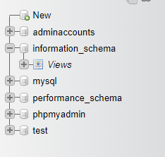
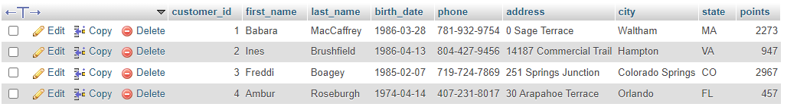

# Table of Contents
- [Table of Contents](#table-of-contents)
- [Database](#database)
  - [Database Management System (DBMS)](#database-management-system-dbms)
    - [Relational DBMS](#relational-dbms)
    - [Non-relational DBMS](#non-relational-dbms)
- [MySQL](#mysql)
  - [Schema](#schema)
  - [Tables](#tables)
  - [Retrieving from Tables](#retrieving-from-tables)
    - [USE Statement](#use-statement)
    - [SELECT Statement](#select-statement)
  - [Multi-statement MySQL Queries](#multi-statement-mysql-queries)
  - [MySQL Clauses](#mysql-clauses)
    - [FROM Clause](#from-clause)
    - [WHERE Clause](#where-clause)
    - [ORDER BY Clause](#order-by-clause)
    - [AS Clause](#as-clause)
    - [DISTINCT Clause](#distinct-clause)
  - [Query Execution Order](#query-execution-order)
  - [Comments in MySQL](#comments-in-mysql)
  - [Statements vs Clauses](#statements-vs-clauses)
  - [Comparison Operators](#comparison-operators)
    - [Comparing Integers](#comparing-integers)
    - [Comparing Strings](#comparing-strings)
    - [Comparing Dates](#comparing-dates)
  - [Logical Operators](#logical-operators)
    - [AND](#and)
    - [OR](#or)
    - [NOT](#not)
  - [Matching Clauses](#matching-clauses)
    - [IN](#in)
    - [BETWEEN](#between)
    - [LIKE](#like)
    - [REGEXP](#regexp)
  - [Looking for Nullity](#looking-for-nullity)
    - [IS NULL](#is-null)
    - [IS NOT NULL](#is-not-null)
  - [Ordering Records](#ordering-records)
    - [ORDER BY](#order-by)
    - [LIMIT](#limit)
  - [Joining](#joining)
    - [(INNER) JOIN](#inner-join)
    - [ON](#on)
    - [Aliasing Tables to Make Joins Cleaner](#aliasing-tables-to-make-joins-cleaner)
    - [Joining Across Databases](#joining-across-databases)
    - [Self Joins](#self-joins)
    - [Joining Multiple Tables](#joining-multiple-tables)
    - [Compound Joins](#compound-joins)
    - [OUTER JOINS](#outer-joins)

# Database
A collection of data stored in a format that can be easily accessed.

## Database Management System (DBMS)
Allows for management and modification of databases through queries. Queries are requests used to access data from a database for retrieving and manipulating.

### Relational DBMS
Data is stored in tables connected through relationships. Each table stores data about an object.

<pre>
Customer <-> Orders
               ^
               |
               ⌄
            Products
</pre>

An example of a database containing three table. The customer is related to the orders table via what exactly he or she bought while the orders table is related to the products table as the orders table list exactly what products are being bought.

Examples of Relational DBMS:
1. MySQL
2. SQLite
3. MariaDB

Example of Relational DBMS Code (Query):
> ```sql
> SELECT *
> FROM products
> WHERE category = 'food'
> ORDER BY price
> ```

### Non-relational DBMS
Data is not stored in tables and there are no relationships.

Examples:
1. Spreadsheets
2. JSON
3. Text files
4. NoSQL

# MySQL
A widely used relational database management system. Free and open-source.

## Schema
A set of database objects -- such as tables and views. It includes the structure of those objects, but not the actual data that they contain.



## Tables
Contains the rows and columns of data. Each column has a unique name used to identify the type of data stored in it. Each row is a record of multiple kinds of data pertaining to a single object.



The above table contains the column customer_id containing a unique id representing each customer. The other columns contain data partaining to the name, birthdate, number, location, and customer points.

## Retrieving from Tables
### USE Statement
**USE** - select a database for querying.

> ```sql
> `USE sql_store`
> ```

The above code will select the database sql_store.

### SELECT Statement
**SELECT** - select columns in a table for querying.

> ```sql
> SELECT * FROM orders
> ```

The above code will select all columns in a table (and display them if you're using a visual database design tool). 

> ```sql
> SELECT customer_id, first_name FROM orders
> ```

The above code will select just the columns customer_id and first_name.

## Multi-statement MySQL Queries
> ```sql
> USE sql_store;
> SELECT customer_id, first_name FROM orders;
> ```

Keep in mind to have a semi-colon at the end of each statement in a multi-statement query.

## MySQL Clauses
Clauses are MySQL functions that help access a particular set of records.

Examples of clauses are:
1. WHERE - filter the query result where data is of specific value.
2. ORDER BY - arrange the result set either in ascending or descending order.
3. HAVING - apply functions in the query with the WHERE clause.
4. TOP - determine the number of record rows to be shown in the result.
5. GROUP BY - group rows that have the same values in the result set.
6. FROM - determines which table in a database to gather records from.
7. SELECT - select columns in a table for querying.
8. USE - select a database for querying.
9. AS - rename a column.
10. DISTINCT - remove duplicates of a result.

### FROM Clause
**FROM** - determines which table in a database to gather records from.

> ```sql
> SELECT * FROM customers
> ```

The above code will gather every record from the table customers.

### WHERE Clause
**WHERE** - filter the query result where data is of specific value.

> ```sql
> SELECT * FROM customers 
> WHERE customer_id = 1
> ```

The above code will filter the result so as to only show the record where the value of the column customer_id is equal to 1.

### ORDER BY Clause
**ORDER BY** - arrange the result set either in ascending order.

> ```sql
> SELECT * FROM customers
> ORDER BY first_name
> ```

The above code will order the query result/show the records in descending order.

### AS Clause
**AS** - give alias to a column or table. Useful for when columns are created on query.

> ```sql
> SELECT 
>     last_name,  
>     first_name, 
>     points, 
>     (points + 10) * 100 AS discount -- Rename columns using the AS clause
> FROM customers 
> ```

The above code will rename the column where mathematical operation on the values of points are shown. Otherwise its name will be '(points + 10) * 100' but now it will display as discount which is way better.

### DISTINCT Clause
**DISTINCT** - remove duplicates of a result. Useful if you only need to count one of the results.

> ```sql
> SELECT DISTINCT state -- filter result to only show one result of each data
> FROM customers;       -- in a column, so if two people live in VA instead of
>                       -- displaying two VAs the result will only be one VA
> ```

## Query Execution Order
> SELECT > DISTINCT > AS > FROM/JOIN > WHERE > GROUP BY > HAVING > ORDER BY > LIMIT

The execution of queries have an order which cannot be changed.

## Comments in MySQL
> ```sql
> -- This is a comment that will not be executed
> SELECT * -- Select every column
> ```

To comment out lines in MySQL use two dashes and a space, '-- ', like so.

## Statements vs Clauses
> ```sql
> SELECT * FROM customers
> ```

The above is a statement, basically it's a complete line of a MySQL query while below is a clause, a single keyword that performs a function.

> `SELECT`

## Comparison Operators
These operators are used in the WHERE clause to filter the results to a certain value or up to a certain value or below a certain value or whatever that is not that value.

Comparison operators:
1. \> - greater than.
2. \>= - greater than or equal to.
3. < - less than.
4. <= - less than or equal to.
5. = - equal to
6. != or <> - not equal to.

### Comparing Integers
> ```sql
> SELECT *
> FROM customers
> WHERE points > 3000; -- retrieve all records where a customer's points is
>                      -- greater than 3000
> ```

The above code will filter the results to records with points value greater than 3000.

### Comparing Strings
> ```sql
> SELECT *
> FROM customers
> WHERE state = 'va'; -- retrieve all records where a customer's state is VA
>                     -- note how the query string is all lower case
>                     -- MySQL is case-insensitive
> ```

The above code will filter the results to all customers with a state of VA.

> ```sql
> SELECT *
> FROM customers
> WHERE state <> 'va'; -- retrieve all records where a customer's state is 
>                      -- not VA
>                      -- note the usage of <> instead of != to comply with
>                      -- standards
> ```

The above code will filter the results to all customers that is not from the state of VA.

### Comparing Dates
> ```sql
> SELECT *
> FROM persons
> WHERE birth_day > '2009-11-31' -- retrieve everyone who is Gen Alpha (skibidi)
> ```

The above code will get anyone who was born from the year 2010 onwards, basically anyone who is Gen Alpha (no cap).

## Logical Operators
Logical operators combine logical conditions in a WHERE clause to create complex queries.

List of MySQL Logical Operators:
1. ALL - TRUE if all of the subquery values are TRUE.
2. AND - TRUE if the conditions separated by AND is TRUE.
3. ANY - TRUE if any of the subquery values is TRUE.
4. BETWEEN - TRUE if the operand is within the range of comparisons.
5. EXISTS - TRUE if the subquery returns one or more records.
6. IN - TRUE if the operand is equal to one of a list of expressions.
7. LIKE - TRUE if the operand matches a pattern.
8. NOT - Displays a record if the condition(s) is NOT TRUE.
9. OR - TRUE if any of the conditions separated by OR is TRUE.
10. SOME - TRUE if any of the subquery values meet the condition.
    
### AND
**AND** - returns results if both subqueries returns a record where the desired data are both found.

> ```sql
> SELECT *
> FROM customers
> WHERE birth_date > '1989-12-31' AND points > 1000; -- from 1990 and above
>                                                    -- and with points
>                                                    -- greater than 1000
> ```

The above code will get every customer with birthdate from 1990 onwards and has points greater than 1000.

### OR
**OR** - returns results if either subquery returns a record where the desired data is found.

> ```sql
> SELECT *
> FROM customers
> WHERE birth_date >= '1990-01-01' OR points > 1000; -- from 1990 and above
>                                                    -- or with points
>                                                    -- greater than 1000
> ```

The above code will get every customer with birthdate from 1990 onwards or has points greater than 1000.

### NOT
**NOT** - negate the subquery and return the opposite.

> ```sql
> SELECT 
>     *
> FROM 
>     customers
> WHERE NOT
>     birth_date >= '1990-01-01' -- using NOT to get customers not born after 
>     OR (points > 1000          -- 1989 or do not have points greater than 1000
>     AND state = 'VA');         -- and not living in VA
> ```

The above code will get every customer with birthdate below 1990 onwards and has points less than 1000.

## Matching Clauses
### IN
**IN** - return records where one of the listed items is found. 

> ```sql
SELECT
    *
FROM
    customers
WHERE
    state IN ('VA', 'FL', 'GA'); -- same as above but using IN 
> ```

The above code will get all records where the state is any of these three: VA, FL, GA.

> ```sql
SELECT
    *
FROM
    customers
WHERE
    state NOT IN ('VA', 'FL', 'GA'); -- same as above but using IN 
> ```

Using NOT clause to negate the query.

### BETWEEN
**BETWEEN** - return records with data in range of the two given values.

> ```sql
SELECT
    *
FROM
    customers
WHERE
    points
    BETWEEN 1000 AND 3000; -- same thing but using BETWEEN, better
> ```

The above code will get values between 1000 and 3000.

### LIKE
**LIKE** - return records that match the given pattern. Uses the special characters '%' and '_'.

Special Characters:
1. % - any number of characters.
2. _ - any exactly one character.

> ```sql
> SELECT 
>     *
> FROM
>     customers
> WHERE
>     last_name LIKE 'b%' -- match any last name beggining with b
>                         -- % => any number of characters
> ```                        

The above code will match last names beggining with b and followed by any number of characters.

> ```sql
> SELECT 
>     *
> FROM
>     customers
> WHERE
>     last_name LIKE '%b' -- match any last name ending with b
> ```

The above code will match last names ending with b preceded by any number of characters.

> ```sql
> SELECT 
>     *
> FROM
>     customers
> WHERE
>     last_name LIKE '%b%' -- match any last name with b somewhere in the middle
> ```

The above code will match last names with b preded by and followed by any number of characters.

> ```sql
> SELECT 
>     *
> FROM
>     customers
> WHERE
>     last_name LIKE '_____y' -- match any last name ending with y and with 
>                             -- exactly 5 characters before y
> ```

The above code will match exactly a six string last name ending in y.

### REGEXP
**REGEXP** - match a data according to a regular expression.

> ```sql
> SELECT 
>     *
> FROM
>     customers
> WHERE
>     last_name REGEXP '^field' -- match any last name beggining with field
> ```

The above code will match any last name with field at the beggining.

> ```sql
> SELECT 
>     *
> FROM
>     customers
> WHERE
>     last_name REGEXP 'field$' -- match any last name ending with field
> ```

The above code will match any last name with field at the ending.

> ```sql
> SELECT 
>     *
> FROM
>     customers
> WHERE
>     last_name REGEXP 'field|mac' -- match any last name with field or mac
> ```

The above code will match any last name containing the strings field or mac.

> ```sql
> SELECT 
>     *
> FROM
>     customers
> WHERE
>     last_name REGEXP '[gim]e' -- match any last name with ge, ie, or me
>                               -- anywhere in the string
> ```

The above code will match any last name containing the strings ge, ie, or, me.

> ```sql
> SELECT 
>     *
> FROM
>     customers
> WHERE
>     last_name REGEXP '[a-h]e' -- match any last name with a to h + e
> ```

The above code will match any last name containing the strings from a to h alphabetically plus an e to each letter.

## Looking for Nullity
### IS NULL
**IS NULL** - match data that is empty.

> ```sql
> SELECT
>     *
> FROM
>     customers
> WHERE
>     phone IS NULL -- match any customer without a phone number
> ```

The above code will match all customers without a phone number set.

### IS NOT NULL
**IS NOT NULL** - using NOT to negate IS NULL to match data that is not empty.

> ```sql
> SELECT
>     *
> FROM
>     customers
> WHERE
>     phone IS NOT NULL -- match any customer with a phone number
> ```

The above code will match all customers with a phone number set.

## Ordering Records
### ORDER BY
**ORDER BY** - return records in ascending order (default) with integers, a to z alphabetically with strings, and latest last with date.

> ```sql
> SELECT
>     *
> FROM
>     customers
> ORDER BY    
>     first_name; -- sort customers name ascending order
> ```

The code above will sort the customers by their first names a to z.

> ```sql
> SELECT
>     *
> FROM
>     customers
> ORDER BY    
>     first_name DESC; -- sort customers name descending order
> ```

The code above will sort the customers by their first names z to a.

> ```sql
> SELECT
>     *
> FROM
>     customers
> ORDER BY    
>     state, first_name DESC; -- sort customers by their state 
>                             -- in ascending order
>                             -- first then first_name in descending order
> ```

The code above will sort in a to z the states then if two people are from the same state sort in z to a.

> ```sql
> SELECT
>     *
> FROM
>     customers
> ORDER BY    
>     birth_date;
> ```

The code above will sort customers from oldest to youngest.

> ```sql
> SELECT
>     first_name, last_name, 10 AS points 
> FROM
>     customers
> ORDER BY    
>     points, first_name;
> ```

The code above will sort customers by the new alias note that since they all have the point of 10 just sorting by points won't really do anything this is merely an example that you can order by alias.

> ```sql 
> SELECT 
>     * 
> FROM
>     customers
> ORDER BY    
>     birth_date; 
> ```

The code above will sort customers from oldest to youngest

> ```sql
> SELECT
>     first_name, last_name, 10 AS points 
> FROM
>     customers
> ORDER BY    
>     1, 2 -- 
>          -- 
>          -- 
>          -- 
> ```

So basically like this, sort by 1 => the first column selected so first_name, and 2 => the second column selected so last_name, this is basically aliasing. A bit simpler but should be avoided as columns selected are quite volatile.

### LIMIT
**LIMIT** - limit the result to a certain number. 

> ```sql
> SELECT
>     *
> FROM
>     customers
> LIMIT    
>     9; 
> ```

> ```sql
> The code above will limit row of records to only 9.
> 
> SELECT
>     *
> FROM
>     customers
> LIMIT    
>     6, 3;
> ```

The code above will limit row of records to the 7th to 9th record this is called an offset, it means skip the first six records then display the following three rows.

## Joining
### (INNER) JOIN
**JOIN** - combine rows from two or more tables, based on a related column between them.

> ```sql
> -- join the orders and customers table via their shared column customer_id
> SELECT
>     *
> FROM
>     orders
> JOIN
>     customers
>     ON orders.customer_id = customers.customer_id 
> ```

The above code will join the orders and customers table via the column customer_id. 

> ```sql
> -- this is the point of joining getting values from another table that 
> -- has a shared column
> SELECT
>     order_id, first_name, last_name
> FROM
>     orders
> JOIN
>     customers
>     ON orders.customer_id = customers.customer_id 
> ```

We are now able to select the name of the customers since the orders table is now connected via our (INNER) JOIN clause.

> ```sql
> -- this won't work as customer_id is in both tables sql would have an
> -- ambiguous error where it doesn't know in which table it should get
> -- the customer_id column from
> SELECT
>     order_id, customer_id, first_name, last_name
> FROM
>     orders
> JOIN
>     customers
>     ON orders.customer_id = customers.customer_id
> ```

When selecting columns keep in mind that the column used to JOIN the tables will then become unselectable as MySQL will be confused as to which table to pull data from.

> ```sql
> -- to solve the issue above prefixed whichever table to get the column from
> SELECT
>     order_id, customers.customer_id, first_name, last_name
> FROM
>     orders
> JOIN
>     customers
>     ON orders.customer_id = customers.customer_id
> ```

Specifically stating in what table to pull the data from will however fix the issue.

> ```sql
> SELECT
>     order_id, orders.customer_id, first_name, last_name
> FROM
>     orders
> JOIN
>     customers
>     ON orders.customer_id = customers.customer_id
> ```

It doesn't matter which table is used to solve an ambiguous error.

### ON
**ON** - combine in what column two or more tables.

> ```sql
> -- join the orders and customers table via their shared column customer_id
> SELECT
>     *
> FROM
>     orders
> JOIN
>     customers
>     ON orders.customer_id = customers.customer_id 
> ```

Note the ON, JOIN needs an ON clause to function so it's JOIN-ON. Without an ON clause and the provided column a JOIN clause will not know where exactly to join two or more tables.

### Aliasing Tables to Make Joins Cleaner
**AS** - alias tables and columns.

> ```sql
> -- aliasing your tables would make prefixing much easier
> SELECT
>     order_id, o.customer_id, first_name, last_name
> FROM
>     orders AS o
> JOIN
>     customers AS c
>     ON o.customer_id = c.customer_id
> ```

Either with the AS clause.

> ```sql
> -- AS clause can be completely foregone when aliasing
> SELECT
>     order_id, o.customer_id, first_name, last_name
> FROM
>     orders o
> JOIN
>     customers c
>     ON o.customer_id = c.customer_id
> ```

Or without the AS clause, aliasing will still work.

### Joining Across Databases

> ```sql
> USE sql_store;
>
> SELECT
>     *
> FROM
>     order_items oi
> JOIN sql_inventory.products p
>     ON oi.product_id = p.product_id
> ```

To join two tables from different databases simply prefix the name of the database before the name of the table. In this case the products table comes from the sql_inventory database while the order_items table has no need for prefixing because we are querying inside it already.

### Self Joins
Tables can be joined with themselves. 

> ```sql
> USE sql_hr;
> 
> -- This self join gets all the value of reports_to and matches it to the 
> -- equivalent value in employee_id to create on organization chart (The
> -- employees and who their manager are)
> SELECT 
>     e.employee_id,
>     e.first_name,
>     m.first_name AS manager
> FROM
>     employees e
> JOIN
>     employees m
>     ON e.reports_to = m.employee_id
> ```

The code above will list the manager who is also an employee as a column of each employee he or she manages.

### Joining Multiple Tables
Tables can be joined with multiple other tables.

> ```sql
> SELECT *
> FROM orders o
> JOIN customers c
>     ON o.customer_id = c.customer_id
> JOIN order_statuses os
>     ON o.status = os.order_status_id
> ```

Joins the orders table with the customers table via customer_id and then joins the orders table with the order_statuses table via the order_status_id column note that the column has a different name in the orders table

> ```sql
> SELECT 
>     o.order_id,
>     o.order_date,
>     c.first_name,
>     c.last_name,
>     os.name AS status
> FROM orders o
> JOIN customers c
>     ON o.customer_id = c.customer_id
> JOIN order_statuses os
>     ON o.status = os.order_status_id
> ```

Same as above but display only certain columns to display an owner's order status

### Compound Joins
Tables can be joined on more than one similar pair of columns.

> ```sql
> SELECT *
> FROM order_items oi
> JOIN order_item_notes oin
>     ON oi.order_id = oin.order_id
>     AND oi.product_id = oin.product_id
> ```

The above code will join two table on 4 columns in total due to compound joining with two pairs of columns.

### OUTER JOINS
